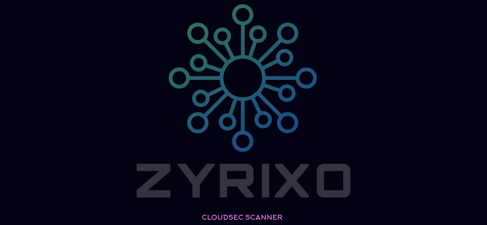

# 
#### CloudSec Misconfiguration Scanner 4 AWS*

## 🚀 Overview

*ZYRIXO* is a powerful tool designed to identify potential misconfigurations in your AWS cloud resources. By leveraging best practices and security guidelines, this scanner helps you maintain a secure cloud environment, ensuring your assets are protected against vulnerabilities.


## 📦 Features

- **Comprehensive Scanning**: Analyze various AWS services for misconfigurations.
 - ***NOTE***: *Currently supporting  AWS only.*
## 🔧 Installation

### Prerequisites

Make sure you have the following installed on your machine:

- Rust (v1.60 or newer)
- Cargo (comes with Rust)

### Steps to Install

1. *Clone the Repository:*
   ```bash
   git clone https://github.com/ch3332xr/zyrixo.git
   cd zyrixo
   cargo build
   cargo run
   
   
#### 🔧 Coming soon!
- *DOCKER BUILDS*
#### 🤝 Contributing
 - Welcome
 - Fork/Branch/Changes/Push to branch
 
#### 📄 License
 - *TBD*

#### 📞 Contact
  - https://github.com/ch3332xr
